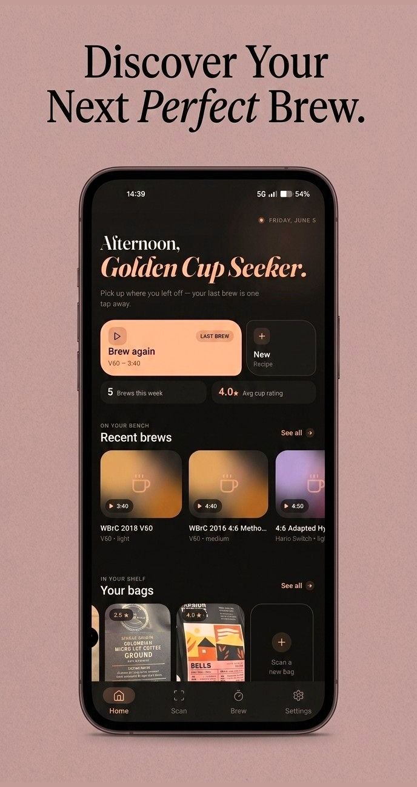
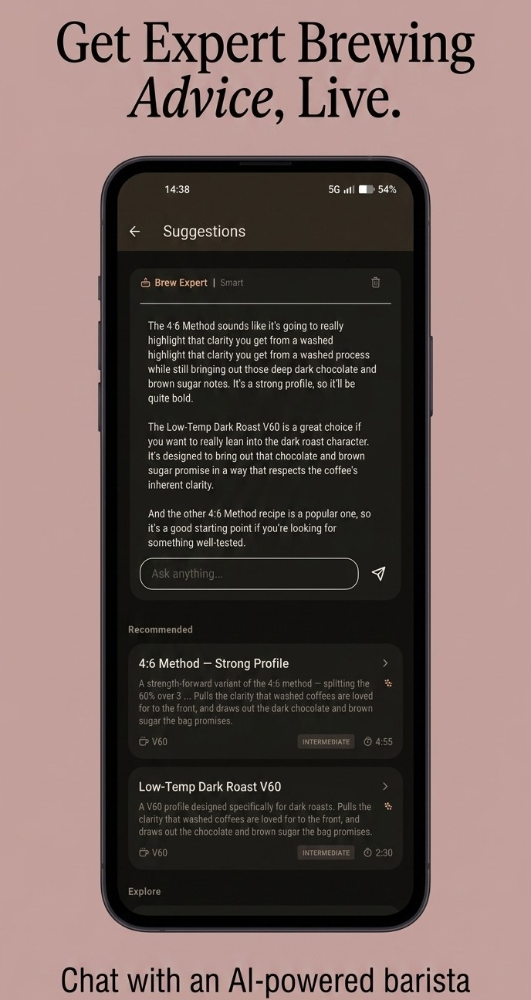
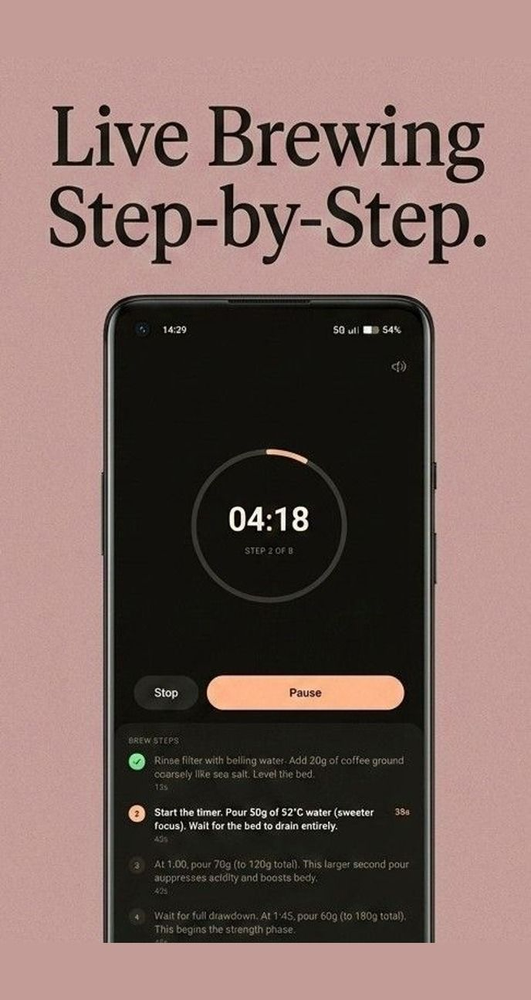
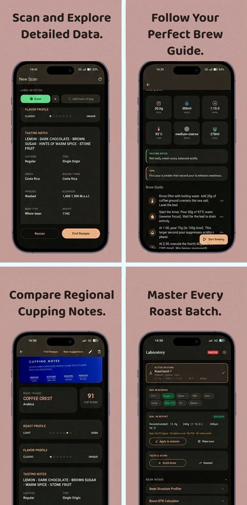

  

  Point your camera at any coffee bag and Coffee Aeye reads the label, builds a full bean dossier, 
  matches it to brew recipes, and walks you through the pour — entirely on-device. No cloud, no account, no data leaves your phone.

  

  
  
  
  

---

  
  &nbsp;
  
  &nbsp;
  

##  One photo. A complete bean dossier.

Snap the front (and back) of any coffee bag. On-device OCR plus a local Gemma vision model turn the label into structured data — tasting notes, origin, region, process, roast level, elevation, varietal, caffeine, bag weight — while the AI runs in the background so results feel instant.

<table><tr>
<td width="50%" valign="top"><b>100% on-device AI</b> Gemma vision + ML Kit text recognition run locally. Works offline; your bags and brews never leave the phone.</td>
<td width="50%" valign="top"><b>Front + back capture</b> Add the back of the bag for richer cupping notes, roast dates, and freshness tracking.</td>
</tr><tr>
<td width="50%" valign="top"><b>Roast &amp; flavor profiling</b> Every bag gets a roast-level slider, classic→unique flavor scale, and a cupping-notes card.</td>
<td width="50%" valign="top"><b>Your shelf, organized</b> A visual library of every bag with photos, freshness rings, and resting/degas status at a glance.</td>
</tr></table>

##  Recipes that fit *this* bag

A seven-signal matching engine scores every recipe against the scanned bean — process, roast, flavor direction, method, and more — and explains *why* each one fits ("pulls the clarity that washed coffees are loved for"). Rate your brews and a taste-profile model learns your palate, surfacing "Because you liked…" suggestions.

**Chat with an AI barista.** The built-in Brew Expert discusses the recommendations live — ask why a 4:6 method suits a dark roast, or how to push sweetness — all answered by the on-device model.

##  Guided brewing, step by step

A full-screen brew-along timer with a progress ring, per-step instructions, and audio cues keeps your hands on the kettle, not the phone. Connect a Bluetooth scale — **Bookoo, Decent, Felicita** — and watch live weight and flow rate right in the brew screen.

<table><tr>
<td width="50%" valign="top"><b>Smart feedback loop</b> Rate the cup, tag what was off (bitter, sour, weak…), and the rating advisor translates it into concrete grind/temp/ratio moves for next time.</td>
<td width="50%" valign="top"><b>Grinder dial mapping</b> 18 seeded grinder specs (Comandante, Niche Zero, DF64, Fellow Ode, 1Zpresso…) plus custom two-anchor mapping — recipes show settings in <i>your</i> grinder's clicks.</td>
</tr><tr>
<td width="50%" valign="top"><b>Brew history &amp; stats</b> Every session logged: recipe, bag, rating, notes — with weekly stats on the home screen.</td>
<td width="50%" valign="top"><b>Freshness &amp; reminders</b> Degas windows, resting timers, and local notifications when a bag hits its peak.</td>
</tr></table>

##  A coffee-science laboratory

For the obsessed: a dedicated Lab with dial-in reports, run tracking, and a suite of master-tier analysis tools.

<table><tr>
<td width="50%" valign="top"><b>Extraction Yield &amp; TDS</b> Pair a DiFluid R2 refractometer over BLE, or enter TDS manually — EY trends charted run over run.</td>
<td width="50%" valign="top"><b>Bean Structure Profiler</b> Density-based structural analysis of the green/roasted bean.</td>
</tr><tr>
<td width="50%" valign="top"><b>Permeability (Darcy k) · Slurry Temp · Surface Area</b> Physics-grade calculators charted per run, oldest → newest.</td>
<td width="50%" valign="top"><b>Roast DTR · PSD Logger · Bypass Calculator</b> Development-time ratio, particle-size distribution, and bypass dilution tools.</td>
</tr><tr>
<td width="50%" valign="top"><b>Matrix Optimizer &amp; Sensory Triage</b> Finds the optimal direction across your logged runs and triages taste faults against the WCR lexicon.</td>
<td width="50%" valign="top"><b>Water profiles &amp; comp scoring</b> Water recipe builder plus competition-style score sheets, accuracy/speed drills, and preference brackets.</td>
</tr></table>

  

##  Yours, offline

- **No account. No cloud. No tracking.** Every model runs on your device; every record lives in a local SQLite database.
- **Full backup &amp; restore** — export your entire shelf, recipes, and lab data as a single archive and share or re-import it anywhere.

---

  

<i>Coffee Aeye — the whole coffee journey, from bag label to golden cup.</i>

