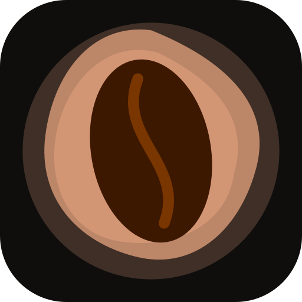

  

<h1 align="center">Coffee Aeye</h1>

<b>Scan the bag. Match the recipe. Brew it perfectly — with an AI barista in your pocket.</b>

  Point your camera at any coffee bag and Coffee Aeye reads the label, builds a full bean dossier, 
  matches it to the right recipes, and walks you through the pour — powered by on-device AI that feels instant.

  

  
  
  
  

  <a href="https://jk-hosting.github.io/CoffeeAeye-App/"><b>▸ View the interactive showcase</b></a>

---

  
  &nbsp;
  
  &nbsp;
  

##  One photo. A complete bean dossier.

Snap the front (and back) of any coffee bag and on-device AI reads the label for you — capturing tasting notes, origin, region, process, roast level, elevation, varietal, caffeine, and bag weight into a complete bean dossier. The vision model works in the background, so a full profile is ready the moment you finish shooting.

<table><tr>
<td width="50%" valign="top"><b>100% on-device AI</b> A powerful vision model turns any label into a rich, structured profile — no typing, no manual entry, ready in seconds. Miss a detail? Tap to edit any field by hand.</td>
<td width="50%" valign="top"><b>Front + back capture</b> Add the back of the bag to pull in roast dates, richer cupping notes, and everything the front leaves out — the more you shoot, the deeper the profile.</td>
</tr><tr>
<td width="50%" valign="top"><b>Roast &amp; flavor profiling</b> Every bag gets a roast-level slider, a classic→unique flavor scale, and a cupping-notes card you can fine-tune to match the cup in front of you.</td>
<td width="50%" valign="top"><b>Your shelf, organized</b> A visual library of every bag with photos, freshness rings, and resting/degas status at a glance — see what's peaking and what still needs to rest without opening a single label.</td>
</tr></table>

##  Recipes that fit *this* bag

A seven-signal matching engine scores every recipe against the scanned bean — process, roast level, flavor direction, brew method, dose, and more — then ranks them and explains *why* each one fits in plain language ("pulls the clarity that washed coffees are loved for"). No guesswork, no generic presets: every suggestion is tuned to the beans in your hand.

<table><tr>
<td width="50%" valign="top"><b>Learns your palate</b> Rate your brews and a taste-profile model builds a picture of what you actually enjoy, surfacing a "Because you liked…" row of beans and recipes matched to your taste.</td>
<td width="50%" valign="top"><b>Knows how you brew</b> A live dossier reads your real history — favourite methods, ratios, and origins — so recommendations reflect your habits, not a textbook.</td>
</tr></table>

**Chat with an AI barista.** The built-in Brew Expert talks through any recommendation live — ask why a 4:6 method suits a dark roast, how to push more sweetness, or what to change when yesterday's cup fell flat — answered instantly by the on-device model.

##  Guided brewing, step by step

A full-screen brew-along timer with a progress ring, per-step pour instructions, and audio cues keeps your hands on the kettle, not the phone. Connect a Bluetooth scale — **Bookoo, Decent, Felicita** — and watch live weight and real-time flow rate right on the brew screen, so you hit every target the moment it happens.

<table><tr>
<td width="50%" valign="top"><b>Smart feedback loop</b> Rate the cup, tag what was off (bitter, sour, weak, hollow…), and the rating advisor turns it into concrete grind, temperature, and ratio moves for your very next brew.</td>
<td width="50%" valign="top"><b>Grinder dial mapping</b> 18 seeded grinder profiles (Comandante, Niche Zero, DF64, Fellow Ode, 1Zpresso, Timemore…) plus custom two-anchor mapping — every recipe shows its grind in <i>your</i> grinder's own clicks and numbers.</td>
</tr><tr>
<td width="50%" valign="top"><b>Brew history &amp; stats</b> Every session is logged — recipe, bag, rating, notes — and rolled into weekly stats on the home screen so you can watch your brewing improve over time.</td>
<td width="50%" valign="top"><b>Freshness &amp; reminders</b> Automatic degas windows, resting timers, and local notifications tell you the moment a bag hits its flavor peak — and when it's starting to slide past it.</td>
</tr></table>

##  A coffee-science laboratory

For the obsessed: a dedicated Lab that walks a bag through the full workflow — intake, preparation, brew, measurement, and iteration — with a suite of master-tier calculators, every result charted run over run.

<table><tr>
<td width="50%" valign="top"><b>Bean intake</b> Bean Structure Profiler (density, moisture, cellular structure), Roast DTR from first-crack-to-drop time, and a Degassing Predictor that calls the ideal rest window from roast level and density.</td>
<td width="50%" valign="top"><b>Preparation</b> A Water Workbench for mineral recipes, a Grind Surface Area estimator, and a Particle Size (PSD) logger to dial in your distribution.</td>
</tr><tr>
<td width="50%" valign="top"><b>Brew physics</b> Darcy's Law permeability, Slurry Temp profiler, Puck Tamp pressure, an Espresso Flow profiler, and a Bypass / Dilution calculator — physics-grade, charted per run.</td>
<td width="50%" valign="top"><b>Measure &amp; evaluate</b> Pair a DiFluid R2 refractometer over Bluetooth (or key in TDS) for live Extraction Yield, log "salami" fractional-extraction curves, and score cups on an SCA-standard sensory sheet.</td>
</tr><tr>
<td width="50%" valign="top"><b>Diagnose &amp; iterate</b> A Sensory Triage defect matrix troubleshoots off-flavors against the WCR lexicon, while a Gradient Descent optimizer points to the single best change across all your logged runs.</td>
<td width="50%" valign="top"><b>Competition ready</b> Build routines in the Comp Choreographer, run competition-style score sheets, and drill accuracy, speed, and preference brackets.</td>
</tr></table>

  

##  Everything in one place

- **Your whole coffee world, organized** — every bag, recipe, brew, and lab run kept together in one fast, beautiful library.
- **Full backup &amp; restore** — export your entire shelf, recipes, and lab data as a single archive and re-import it on any device.
- **Ready the moment you open it** — no account to create, no setup, no clutter. Just scan and brew.

---

  

<i>Coffee Aeye — the whole coffee journey, from bag label to golden cup.</i>

